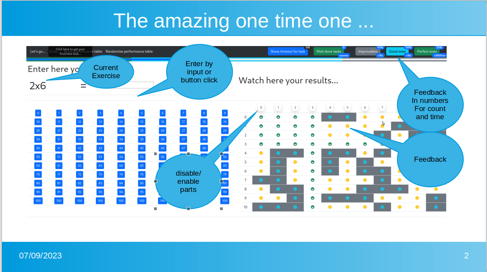

# The amazing 1x1 trainer
A amazing 1x1 trainer ... keep your learners stay tuned...

# Background
As papa of some kids i have also came around the topic of learning the one times one (1x1), there are a lot of stuff out there, but i was (frankly speaking) a little bit bored and this problem got my attention. So what problem, i found that all available solution (limited truly to that what i found) are not adaptive to the person who is doing the exercise. 

# What is in the Box
So "The amazing 1x1 trainer" does exactly this, it adapts to the speed of the learner and so one can become happy already if it takes 30 seconds each time for a calculation to be done right, after some time it also gives you a hint what is the right answer.

So one has three goals:
* a ultimate goals - a time limit - when reached the exercise is considered to be past in general.
* a good goal - a average time limit (120% of the average time needed so far for all active exercises) - if reached this exercised degrade over time and therefore become active until you reach the ultimate state.
* a number of exercise per session (so set a target of 50 solved exercised for your trainee)

# How does it look


# How to start...
* Option #1 (not ready at the moment): Just click on the index.cdn.html and you are good to go, this will utilized all dependencies out of the provided cdn network, which may track your usage. (see jsdelivr.net)
* Option #2: Just clone the repo or download the release file 
```console
foo@bar:~$ git clone https://github.com/hastmu/The_amazing_1x1_trainer.git
foo@bar:~$ cd The_amazing_1x1_trainer/
```
* Option #2.1: do a npm install and locally open the index.html.
```console
foo@bar:~$ npm install
foo@bar:~$ firefox file://`pwd`/index.html
```
* Option #2.2: open the index.cdn.html for using a cdn based setup.
```console
foo@bar:~$ firefox file://`pwd`/index.cdn.html
```

# Roadmap
- [x] General PoC
- [x] Ultimate goal implemented
- [x] good goal implemented
- [x] task number goal implemented
- [x] goal reached dialog (simple version)
- [ ] complete tool tips
- [x] implement language button
- next major release
- [ ] Rank system (maybe like beginner-novice-solid-expert-superhero)
- [ ] goal reached dialog (set new target - view improvements)
- next major release
- [ ] Multiplayer? (kind of class-room exercise)

# How to help?
In the end there will not be left so much, besides language, so if you like to make that fly in your language scope, feel free to file a ticket and past you translation there, i will incorporate this then in one of the next releases.

Enjoy.